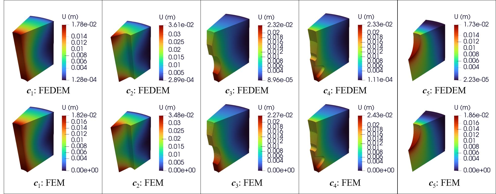
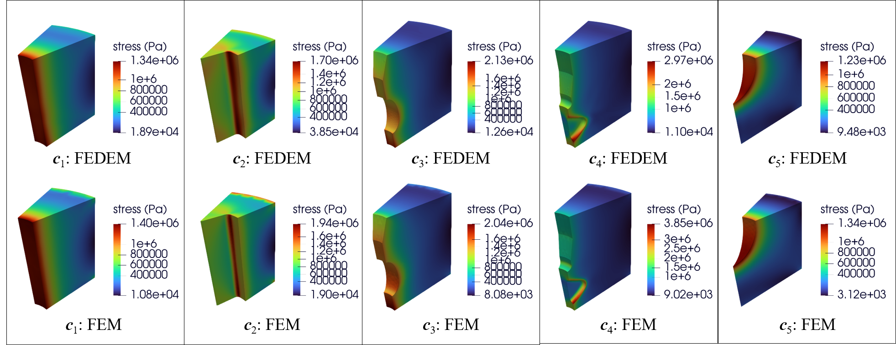

# FEDEM - Finite Element-enhanced Deep Energy Method

FEDEM is a deep learning-based finite element mechanics computation framework for simulating and analyzing hyperelastic problems in solid propellants. This project combines traditional finite element methods with modern deep learning techniques to provide efficient numerical solutions for complex-geometry grains.

*Fig 1: displacement of batched grains simulation results*

*Fig 2: stress of batched grains simulation results*

## Project Structure

The project consists of the following main modules:

- **DEM3D**: vanilla deep energy method for hyperelastic 3D beam bending, according to paper _A deep energy method for finite deformation hyperelasticity_
- **Beam3D**: hyperelastic 3D beam benchmark to examine FEDEM's advantage over DEM proposed in previous works
- **Grain3D**: single complex grain experiment to demonstrate FEDEM's capacity for intricate geometry
- **Grain3D_DataDriven**: ablation study on the loss function to verify the effectiveness of the data-driven design
- **GroupGrains**: batched grains experiment to demonstrate FEDEM's ability of solving multiple propellants in parallel

## Technical Features

- adaptive unstructured meshes to improve local solution accuracy
- Gaussian quadrature for precise numerical integration
- a data-driven framework that combines physics with real-world data
- latent vectors to encode geometric features of different grains

## Usage

1. Configure the `Config.py` file of the corresponding module to set the required parameters
2. Run `Train.py` for model training
3. Use `Evaluate.py` to evaluate results
4. Use ParaView software to visualiza results

## System Requirements

- python 3.11.10
- pyTorch 2.4.1
- numPy
- sciPy
- matplotlib (for visualization)
- meshio
